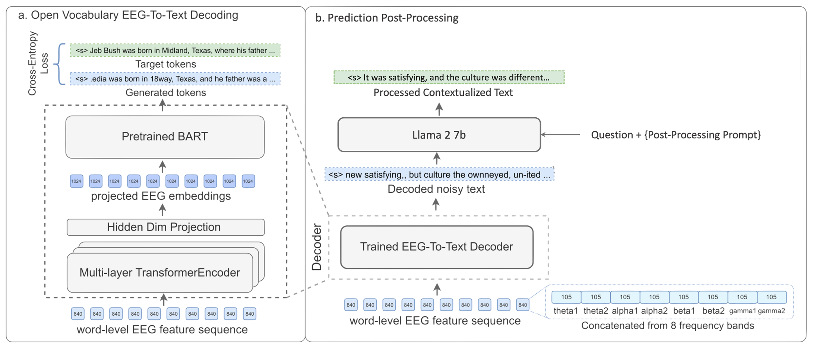

# eeg-to-text-enhanced

One of the first notable works in this domain, proposed an integration of an additional EEG encoder to align pre-trained models, specifically BART, with EEG signals for the task of EEG-to-Text translation. Their approach marked a significant milestone by leveraging BART, a powerful language model, for better representation of textual outputs. This architecture is later developed by many others, leveraging the idea to better performance and prediction.

## **EEG-To-Text Limitation**:
Despite the technical advancement, the model still struggled with generalization to a broader vocabulary, as it relied heavily on structured inputs and lacked the flexibility to deal with open-vocabulary scenarios in EEG-to-Text translation. While the use of a pre-trained LLM was groundbreaking, the reliance on a fixed vocabulary limited the ability to produce dynamic and diverse language representations, especially when considering the vast array of potential concepts that EEG signals could represent.

## **EEG-To-Text Enhancement**:

In a scenario where a patient with locked-in syndrome is asked a question but is unable to respond verbally. The patient thinks of the answer, and the EEG-to-text model decodes this thought into an unstructured sentence. Our prompt-engineered model then takes this unstructured sentence, along with the context of the question, and post-processes it to produce a more structured and meaningful response.
